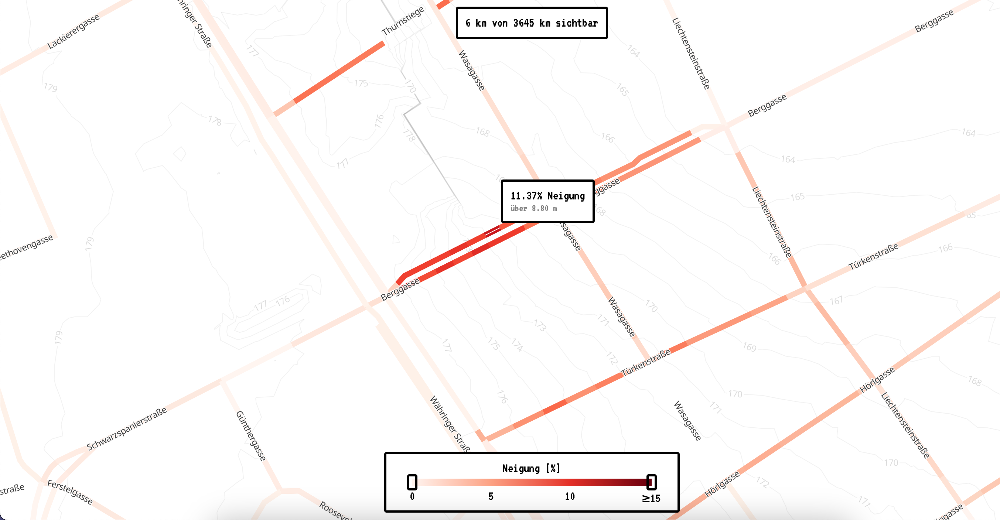

# Wie steil sind Wiens Radstrecken?

Visualisierung der Neigung von für Fahrräder geeigneten Wegen in Wien.

Datenbasis ist das Geländemodell der MA 41.

Weitere Infos im [Blogeintrag](https://elias-gander.github.io/wie-steil-sind-wiens-radstrecken).

[Demo](https://elias-gander.github.io/data-visualization/wie-steil-sind-wiens-radstrecken/)

## Setup

1. Repo clonen

2. Virtuelles Python-environment erstellen und aktivieren

   1. Im Terminal zum Root-Folders des Repos navigieren
   2. `python -m venv ./venv`
   3. `source venv/bin/activate`

3. Benötigte Python Packages installieren: `pip install -r requirements.txt`

4. Alle Zellen des Jupyter-Notebooks (_wiener_strassenbaeume.ipynb_) ausführen

5. Interaktive Kartendarstellung starten

   1. Im Terminal in den _web_-Folder navigieren
   2. `python -m http.server`
   3. Im Browser zu _http://localhost:8000_ navigieren
